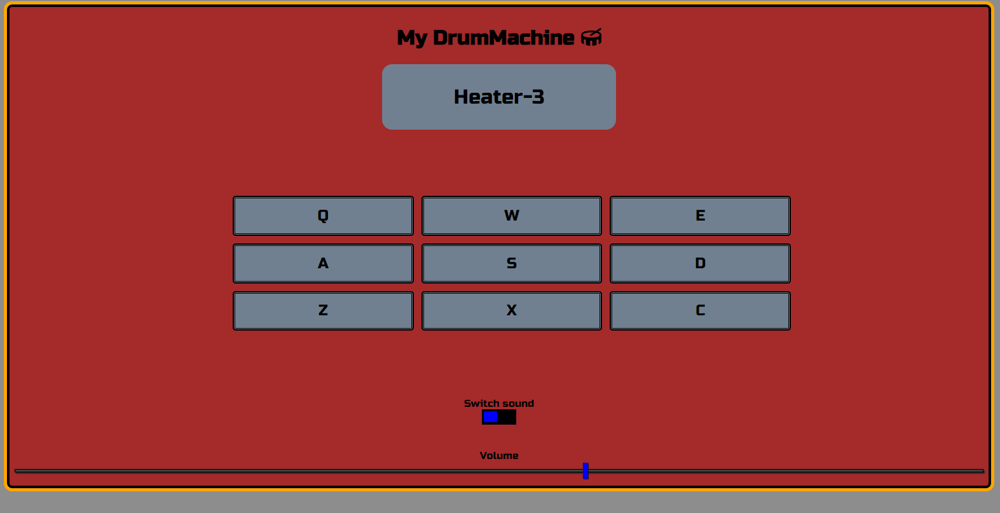

# React-Drum-Machine

### Task instructions -

#### By CodePen - https://www.freecodecamp.org/learn/front-end-development-libraries/front-end-development-libraries-projects/build-a-drum-machine

### My app -

✅ **8/8 tests!**

✅ **Volume adjust by volume slider**

✅ **2 sound banks - switch by toggle button**

